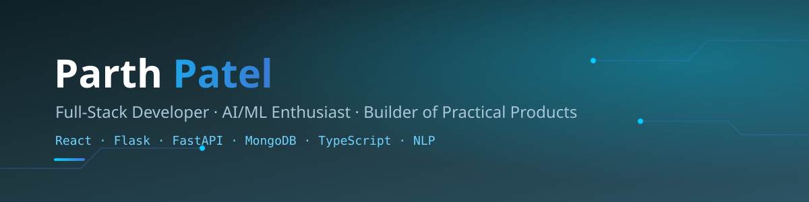

<div align="center">



</div>

<br/>

```bash
parth@dev:~$ whoami
```

> Full-stack developer who keeps ending up on the AI side of the stack — parsing resumes, scoring call transcripts, building the API and the model behind them. I like projects where the interesting part is *making sense of messy input*.

<br/>

```bash
parth@dev:~$ cat interests.log
```

```
[currently building]  AI-powered platforms — resume analysis, call-QA scoring, university discovery
[currently learning]  NLP pipelines, LLM-backed apps, retrieval + memory systems
[comfortable with]    React/TS on the front · Flask/FastAPI on the back · MongoDB/SQLite underneath
[ask me about]        parsing pipelines, REST API design, shipping student/solo projects end-to-end
```

<br/>

## stack.json

<table>
<tr>
<td valign="top" width="50%">

**frontend**
```
React
TypeScript
JavaScript
HTML5
```

**backend**
```
Flask
FastAPI
Node.js
```

</td>
<td valign="top" width="50%">

**data**
```
MongoDB
SQLite
```

**ai / nlp**
```
spaCy
NLP pipelines
LLM integration (in progress)
```

</td>
</tr>
</table>

<br/>

## ./projects

<table>
<tr>
<td width="4%" align="center">🗂️</td>
<td width="96%">

**[resume-checker](https://github.com/PARTH0777-O/resume-checker)**
MCA final-year project — a Smart Resume Analyzer. React frontend, Flask REST API, MongoDB, spaCy-based NLP for parsing and scoring resumes.
`React` `Flask` `MongoDB` `spaCy`

</td>
</tr>
<tr>
<td align="center">🗂️</td>
<td>

**[UniGuj AI](https://github.com/PARTH0777-O/UniGuj-AI-AI-Powered-University-Discovery-Platform-)**
AI-powered discovery platform for universities in Gujarat — compares fees, placements, and program info to help students choose.
`TypeScript` `AI`

</td>
</tr>
<tr>
<td align="center">🗂️</td>
<td>

**[Calliq](https://github.com/PARTH0777-O/Calliq-project)**
AI call-QA platform. Scores transcripts across 5 dimensions, flags risk, generates coaching notes, rolls everything up into a manager dashboard.
`FastAPI` `React` `TypeScript`

</td>
</tr>
<tr>
<td align="center">🗂️</td>
<td>

**[memorax-ai](https://github.com/PARTH0777-O/memorax-ai)**
An AI companion that remembers conversations, tasks, and life events. Full-stack starter — FastAPI, SQLite, voice — built ready to swap in a real LLM.
`FastAPI` `SQLite` `Voice`

</td>
</tr>
<tr>
<td align="center">🗂️</td>
<td>

**[AI Real Estate Platform](https://github.com/PARTH0777-O/Ai-real-estate-platform)**
A real estate discovery platform built with TypeScript.
`TypeScript`

</td>
</tr>
</table>

<br/>

## stats.render()

<div align="center">


</div>

<div align="center">

</div>

<br/>

```bash
parth@dev:~$ connect --with parth
```

<div align="center">

[](mailto:your-email@example.com)
[](https://www.linkedin.com/in/your-linkedin)
[](https://github.com/PARTH0777-O)

</div>

<div align="center">
<sub><code>process exited with code 0</code> — thanks for reading this far ⭐</sub>
</div>
